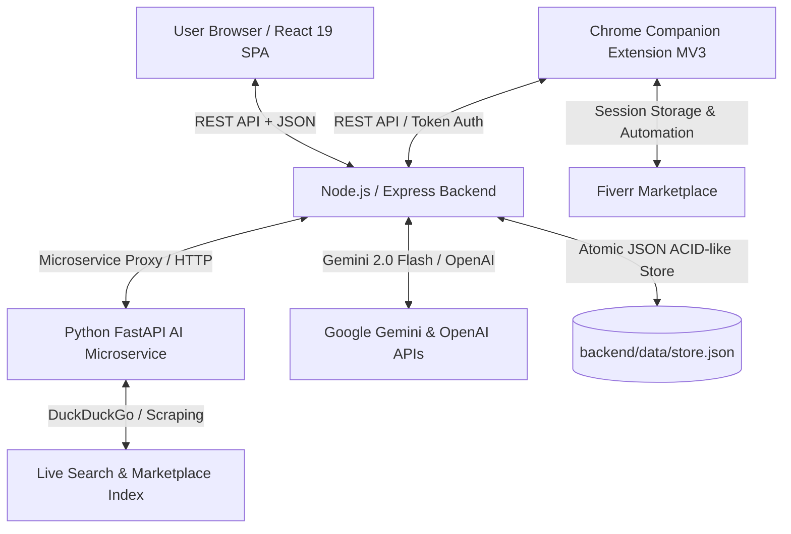

# FiverrGrowth SaaS Platform — Complete Architecture & Codebase Master Manual

---

## 1. Executive System Topology & Architectural Philosophy

The **FiverrGrowth** platform is an enterprise-grade, multi-tier SaaS application engineered to transform freelance developers and agencies into high-earning, top-rated sellers on marketplace platforms (primarily Fiverr). 

The platform operates across four decoupled, high-performance tiers:


### Core Tenets:
1. **Zero Hallucination Context Grounding**: Every prompt and recommendation is anchored in real seller skills, pricing tiers, scraped marketplace signals, or vetted competitor profiles.
2. **Safe-Zone & Anti-Ban Architecture**: Residential browser extension offloads scraping and brief application to the seller's active local IP and residential browser fingerprint, bypassing Cloudflare, Datadome, and Akamai marketplace protections.
3. **Deterministic + Generative Hybrid**: Fast sub-millisecond local rule engines handle pricing metrics, typography rendering, and layout math, while LLM agents (Gemini 2.0 Flash and GPT-4o) handle semantic strategy and client psychology.

---

## 2. Directory Tree & High-Level Module Structure

```
fiverr-growth/
├── .env                                # Environment secrets & API configuration
├── .gitignore                          # Git exclude rules
├── README.md                           # Quickstart & setup documentation
├── start.ps1                           # Automated one-click multi-process orchestrator
├── extension/                          # Chrome Companion Extension (Manifest V3)
│   ├── manifest.json                   # Extension manifest & permissions
│   ├── background.js                   # Persistent service worker & message broker
│   ├── content.js                      # DOM scraper & safe-zone injection script
│   ├── popup.html                      # Extension popup UI layout
│   ├── popup.js                        # Extension popup controller & status sync
│   └── README.md                       # Extension installation & unpacking guide
├── ai_orchestration/                   # Python FastAPI Autonomous Agent Service
│   ├── app/
│   │   ├── main.py                     # FastAPI application entrypoint & routing
│   │   ├── core/
│   │   │   ├── config.py               # Pydantic environment settings
│   │   │   └── llm_router.py           # Multi-provider LLM connector & failover
│   │   ├── agents/
│   │   │   ├── brief_matcher.py        # Autonomous buyer brief semantic analyzer
│   │   │   ├── gig_synthesizer.py      # Multi-stage gig content generator
│   │   │   └── market_spy.py           # Live market & query intelligence extractor
│   │   └── schemas/
│   │       ├── brief.py                # Pydantic data schemas for briefs
│   │       ├── gig.py                  # Pydantic data schemas for gigs
│   │       └── research.py             # Pydantic data schemas for market research
│   └── tests/
│       └── test_agents.py              # Automated Pytest suite for agents
├── backend/                            # Node.js Express REST Backend & Store
│   ├── assets/
│   │   └── flagship_gigs/              # High-res 8K photorealistic commercial assets
│   ├── data/
│   │   └── store.json                  # Atomic flat-file JSON document database
│   ├── logs/
│   │   └── activity.log                # Live appended system and agent activity logs
│   ├── scripts/
│   │   ├── verify-all-apis.ts          # End-to-end integration test runner
│   │   ├── verify-onboarding-flow.ts   # Onboarding & ICP generation test script
│   │   └── verify-step1-scraper.ts     # Fiverr profile scraping verification script
│   ├── src/
│   │   ├── app.ts                      # Express middleware, CORS, and route registration
│   │   ├── server.ts                   # HTTP listener lifecycle & port binding
│   │   ├── config/
│   │   │   └── index.ts                # Environment variable parsing & defaults
│   │   ├── db/
│   │   │   └── store.ts                # Thread-safe persistent JSON database client
│   │   ├── middlewares/
│   │   │   └── auth.middleware.ts      # JWT session verification & role gating
│   │   ├── routes/
│   │   │   └── api.routes.ts           # Central Express router with all API endpoints
│   │   ├── utils/
│   │   │   └── logger.ts               # Structured logging & agent telemetry engine
│   │   ├── swagger/
│   │   │   └── swagger.ts              # OpenAPI / Swagger specification documentation
│   │   ├── controllers/
│   │   │   ├── api.controller.ts       # Legacy gig, brief, and research handlers
│   │   │   ├── auth.controller.ts      # User registration, login, and session checks
│   │   │   ├── briefs.controller.ts    # Safe-zone batch proposal generator & sync
│   │   │   ├── competitor.controller.ts# Competitor scraping & gap analysis engine
│   │   │   ├── gigImageAgent.controller.ts # Visual design agent variations & render
│   │   │   ├── gigStudio.controller.ts # 4-step interrogation & blueprint synthesizer
│   │   │   ├── onboarding.controller.ts# ICP generation & status state machine
│   │   │   ├── scraper.controller.ts   # Fiverr profile scraper & fresh-start loader
│   │   │   ├── strategist.controller.ts# AI diagnostic interview turns & synthesis
│   │   │   └── system.controller.ts    # Agent health diagnostics & live log streaming
│   │   └── services/
│   │       ├── ai.service.ts           # Google Gemini 2.0 Flash SDK client
│   │       ├── auth.service.ts         # Password hashing & JWT signing service
│   │       ├── briefsProposal.service.ts # 4-step conversion proposal generator
│   │       ├── competitorAnalysis.service.ts # Deep statistical gap analysis
│   │       ├── fiverrScraper.service.ts# Direct HTTP scraper for profiles & search
│   │       ├── gigImageAgent.service.ts# 8K asset resolver & Flux engine pipeline
│   │       ├── gigImageAgentKnowledge.ts # 20,242-word design knowledge base
│   │       ├── gigStudio.service.ts    # Dynamic 4-step interrogation question engine
│   │       ├── icpGenerator.service.ts # 4-tier Ideal Customer Profile generator
│   │       ├── liveResearch.service.ts # DuckDuckGo / GitHub live intelligence
│   │       └── strategist.service.ts   # Diagnostic strategist interview engine
│   └── tests/
│       └── api.test.ts                 # Jest API test suite
├── frontend/                           # React 19 + TypeScript + Vite Client
│   ├── public/
│   │   ├── flagship_gigs/              # Static 8K flagship thumbnails
│   │   ├── favicon.svg                 # Brand icon
│   │   └── icons.svg                   # SVG sprite definitions
│   ├── src/
│   │   ├── main.tsx                    # React root DOM mounting & strict mode
│   │   ├── App.tsx                     # React Router, layout shell, & auth gates
│   │   ├── index.css                   # Tailwind v4 directives & custom utilities
│   │   ├── App.css                     # Component animations & transitions
│   │   ├── context/
│   │   │   └── AuthContext.tsx         # Global auth, user session, & context state
│   │   ├── components/
│   │   │   ├── 3d/
│   │   │   │   └── HeroScene.tsx       # Three.js interactive 3D landing scene
│   │   │   ├── auth/
│   │   │   │   └── AuthModal.tsx       # Glassmorphic Login/Register modal dialog
│   │   │   ├── competitors/
│   │   │   │   └── CompetitorsView.tsx # Live competitor radar & gap analysis
│   │   │   ├── dashboard/
│   │   │   │   ├── SellerCockpit.tsx   # Legacy high-level seller metrics view
│   │   │   │   └── SellerDashboardView.tsx # Production dashboard with vitals
│   │   │   ├── guards/
│   │   │   │   └── RouteGuards.tsx     # ProtectedRoute & OnboardingGuard
│   │   │   ├── layout/
│   │   │   │   ├── Navbar.tsx          # Main header navigation bar
│   │   │   │   └── ProfileDropdown.tsx # User profile menu & logout trigger
│   │   │   ├── modules/
│   │   │   │   ├── AgentActivityLogsView.tsx # Live system logger & diagnostics
│   │   │   │   ├── BuyerBriefView.tsx  # Safe-zone batch proposal workstation
│   │   │   │   ├── GigGeneratorView.tsx# Flagship 1280x769 canvas studio & copy
│   │   │   │   ├── MarketResearchView.tsx # Live niche demand & salary explorer
│   │   │   │   └── SavedGigsView.tsx   # Saved gig drafts & export library
│   │   │   ├── onboarding/
│   │   │   │   ├── OnboardingLayout.tsx# 3-step stepper layout wrapper
│   │   │   │   ├── OnboardingStep1.tsx # Profile scraping vs fresh start setup
│   │   │   │   ├── OnboardingStep2.tsx # 4-tier Ideal Customer Profile review
│   │   │   │   ├── OnboardingStep3.tsx # Blueprint review & confirmation
│   │   │   │   └── OnboardingStrategistView.tsx # Legacy diagnostic interviewer
│   │   │   └── settings/
│   │   │       └── SettingsPage.tsx    # Seller profile settings & API tokens
└── docs/                              # Project Documentation & Architecture Guides
    ├── ARCHITECTURE.md                 # System architecture overview
    ├── API_DOCUMENTATION.md            # Complete API endpoints catalog
    ├── TESTING_AND_VALIDATION.md       # Quality assurance & verification plan
    └── project-plan/
        ├── ICP_SYSTEM_DESIGN.md        # Technical specification for ICP agent
        ├── KNOWN_ISSUES.md             # Bug log & remediation tracker
        ├── PROJECT_VISION.md           # Product philosophy & business vision
        └── ROADMAP.md                  # Milestone development roadmap
```

---

## 3. Detailed File-by-File Catalog

### 3.1 Root Configuration & Automation

#### [`/.env`](file:///C:/Users/hp-new/Desktop/fiverr-growth/.env)
* **Why this file exists**: Stores sensitive configuration parameters, API keys, database paths, and runtime flags outside source control.
* **How it works**: Loaded by Node (`dotenv` via `src/config/index.ts`) and Python (`pydantic-settings`). Contains:
  * `PORT=5000`: Port for the Express backend.
  * `JWT_SECRET`: Cryptographic secret for signing seller session tokens.
  * `GEMINI_API_KEY`: API key for Google Gemini 2.0 Flash LLM inference.
  * `OPENAI_API_KEY`: Optional fallback key for GPT-4o models.
  * `AI_ORCHESTRATOR_URL=http://localhost:8000`: Connection URI for the Python microservice.

#### [`/.gitignore`](file:///C:/Users/hp-new/Desktop/fiverr-growth/.gitignore)
* **Why this file exists**: Excludes non-source build artifacts, dependencies, secrets, and environment folders from Git tracking.
* **How it works**: Ignores `node_modules/`, `dist/`, `.env`, `*.log`, `__pycache__/`, and `.venv/`.

#### [`/README.md`](file:///C:/Users/hp-new/Desktop/fiverr-growth/README.md)
* **Why this file exists**: Project introductory README outlining feature highlights, architecture diagrams, prerequisites, and developer instructions.

#### [`/start.ps1`](file:///C:/Users/hp-new/Desktop/fiverr-growth/start.ps1)
* **Why this file exists**: Single-click PowerShell startup automation that spins up the entire platform (Frontend, Backend, and Python service) concurrently.
* **How it works**: Launches three child processes:
  1. `npm run dev` in `backend/` on port `5000`
  2. `npm run dev` in `frontend/` on port `5173`
  3. `uvicorn app.main:app` in `ai_orchestration/` on port `8000`

---

### 3.2 Chrome Companion Extension (`extension/`)

The Chrome Extension runs natively inside the seller's browser to execute automated actions directly on `fiverr.com` using the user's authentic session cookies, residential IP, and browser TLS fingerprint.

#### [`extension/manifest.json`](file:///C:/Users/hp-new/Desktop/fiverr-growth/extension/manifest.json)
* **Why this file exists**: Declares the extension identity, permissions, host permissions, and background/content scripts under Google Manifest V3.
* **How it works**: Requests `activeTab`, `storage`, and `scripting` permissions, with host permissions scoped to `*://*.fiverr.com/*` and `http://localhost:5000/*`.

#### [`extension/background.js`](file:///C:/Users/hp-new/Desktop/fiverr-growth/extension/background.js)
* **Why this file exists**: The extension's persistent service worker handling background message routing, badge status updates, and API relaying.
* **How it works**: Listens for runtime messages (`FIVERR_GIG_DATA_EXTRACTED`, `SYNC_BUYER_BRIEFS`), stores session auth tokens in `chrome.storage.local`, and relays payloads to the backend at `http://localhost:5000/api/v1/scraper/fiverr-profile`.

#### [`extension/content.js`](file:///C:/Users/hp-new/Desktop/fiverr-growth/extension/content.js)
* **Why this file exists**: Content script injected directly into live Fiverr pages (`/users/*`, `/manage_gigs`, `/buyer_briefs`).
* **How it works**: 
  1. Scrapes seller profile metrics directly from the DOM (seller level, rating, active orders, gig cards, tags, pricing tiers).
  2. Scrapes live buyer briefs on the seller dashboard.
  3. Supports safe-zone automation by filling in AI-generated proposals with randomized keystroke delays (50ms–150ms per character) to simulate human typing.

#### [`extension/popup.html`](file:///C:/Users/hp-new/Desktop/fiverr-growth/extension/popup.html) & [`extension/popup.js`](file:///C:/Users/hp-new/Desktop/fiverr-growth/extension/popup.js)
* **Why these files exist**: The browser action popup interface displayed when clicking the extension icon in the toolbar.
* **How they work**: Shows connection status to `localhost:5000`, seller profile sync state, and 1-click actions: "Sync Profile with FiverrGrowth" and "Open Safe-Zone Briefs Hub".

---

### 3.3 Python AI Orchestration Service (`ai_orchestration/`)

FastAPI microservice handling long-running, autonomous scraping, market research, and multi-agent coordination.

#### [`ai_orchestration/app/main.py`](file:///C:/Users/hp-new/Desktop/fiverr-growth/ai_orchestration/app/main.py)
* **Why this file exists**: Entrypoint for the FastAPI microservice.
* **How it works**: Configures CORS middleware, health check endpoint (`/health`), and mounts sub-routers for `/api/v1/agents/brief-matcher`, `/api/v1/agents/gig-synthesizer`, and `/api/v1/agents/market-spy`.

#### [`ai_orchestration/app/core/config.py`](file:///C:/Users/hp-new/Desktop/fiverr-growth/ai_orchestration/app/core/config.py)
* **Why this file exists**: Pydantic BaseSettings class loading configuration from environment variables.
* **How it works**: Validates `OPENAI_API_KEY`, `GEMINI_API_KEY`, `MODEL_NAME`, and `PORT`.

#### [`ai_orchestration/app/core/llm_router.py`](file:///C:/Users/hp-new/Desktop/fiverr-growth/ai_orchestration/app/core/llm_router.py)
* **Why this file exists**: Intelligent LLM abstraction layer providing seamless fallback between Gemini, OpenAI, and local mock endpoints.
* **How it works**: Implements exponential backoff and automatic failover if rate limits (HTTP 429) are encountered.

#### [`ai_orchestration/app/agents/brief_matcher.py`](file:///C:/Users/hp-new/Desktop/fiverr-growth/ai_orchestration/app/agents/brief_matcher.py)
* **Why this file exists**: Autonomous agent that evaluates incoming buyer briefs against a seller's profile.
* **How it works**: Calculates a semantic relevance score (0–100%), extracts budget constraints, identifies technical dealbreakers, and writes custom 4-stage proposals.

#### [`ai_orchestration/app/agents/gig_synthesizer.py`](file:///C:/Users/hp-new/Desktop/fiverr-growth/ai_orchestration/app/agents/gig_synthesizer.py)
* **Why this file exists**: Python-side gig blueprint synthesizer.
* **How it works**: Uses structured prompt chains to create gig titles, search tags, 3-tier pricing matrices, and sales-letter descriptions.

#### [`ai_orchestration/app/agents/market_spy.py`](file:///C:/Users/hp-new/Desktop/fiverr-growth/ai_orchestration/app/agents/market_spy.py)
* **Why this file exists**: Live web scraping and marketplace market intelligence agent.
* **How it works**: Queries search engines (DuckDuckGo), GitHub API, and job boards to detect trending developer skills, average hourly rates, and unmet client demands.

#### [`ai_orchestration/app/schemas/`](file:///C:/Users/hp-new/Desktop/fiverr-growth/ai_orchestration/app/schemas/) (`brief.py`, `gig.py`, `research.py`)
* **Why these files exist**: Pydantic models enforcing type safety, data validation, and automated Swagger schema generation for request/response payloads.

---

### 3.4 Backend Application Tier (`backend/`)

#### [`backend/src/server.ts`](file:///C:/Users/hp-new/Desktop/fiverr-growth/backend/src/server.ts)
* **Why this file exists**: Application entrypoint.
* **How it works**: Imports `app` from `src/app.ts`, binds to `process.env.PORT || 5000`, logs startup banner, and sets up graceful shutdown handlers for `SIGINT` and `SIGTERM`.

#### [`backend/src/app.ts`](file:///C:/Users/hp-new/Desktop/fiverr-growth/backend/src/app.ts)
* **Why this file exists**: Configures Express application middleware, security headers, and router mounting.
* **How it works**: 
  1. Applies `cors()` with origin reflection for local frontend and Chrome extension.
  2. Applies `express.json({ limit: '10mb' })` to support base64 image and profile payloads.
  3. Mounts Swagger UI at `/docs`.
  4. Mounts the central API router at `/api/v1`.

#### [`backend/src/config/index.ts`](file:///C:/Users/hp-new/Desktop/fiverr-growth/backend/src/config/index.ts)
* **Why this file exists**: Centralizes application configuration constants, environment defaults, and directory paths.

#### [`backend/src/db/store.ts`](file:///C:/Users/hp-new/Desktop/fiverr-growth/backend/src/db/store.ts)
* **Why this file exists**: Lightweight, thread-safe, document-oriented persistent JSON store (`backend/data/store.json`).
* **How it works**: 
  - Manages collections for `users`, `userContexts`, `gigs`, `briefs`, `marketIntelligence`, and `competitorReports`.
  - Implements atomic writes via synchronous filesystem write operations, ensuring zero data loss on unexpected process exits.
  - Implements helper query methods: `getUserById`, `getUserContext`, `saveIcpProfiles`, `updateOnboardingStatus`, `saveCompetitorReport`.

#### [`backend/src/middlewares/auth.middleware.ts`](file:///C:/Users/hp-new/Desktop/fiverr-growth/backend/src/middlewares/auth.middleware.ts)
* **Why this file exists**: Enforces user authentication and injects authenticated user records into Express request contexts.
* **How it works**: 
  - `requireAuth`: Reads `Authorization: Bearer <token>`, verifies JWT signature with `JWT_SECRET`, loads user from DB, and attaches to `req.user`. Returns HTTP 401 if missing/invalid.
  - `optionalAuth`: Verifies token if present; continues execution without error if missing (useful for development and test harnesses).

#### [`backend/src/routes/api.routes.ts`](file:///C:/Users/hp-new/Desktop/fiverr-growth/backend/src/routes/api.routes.ts)
* **Why this file exists**: Master routing table mapping HTTP methods and URL paths to specific controller actions.
* **Endpoints Registered**:
  * `/auth/*`: Registration, login, current session (`/me`).
  * `/scraper/*`: Fiverr username scraping, fresh start profiles.
  * `/onboarding/*`: Step progress, ICP generation, ICP confirmation.
  * `/strategist/*`: Interview turn processing and strategy synthesis.
  * `/gigs/*`: Classic synthesis, Studio 4-step interrogation, description tone regeneration, and visual design agent endpoints.
  * `/briefs/*`: Live briefs sync, 4-stage proposal generator, application recorder.
  * `/research/*`: Niche salary analysis, live GitHub tools, keyword demand.
  * `/competitors/*`: Search scraping, competitor profile extraction, statistical gap analysis.
  * `/system/*`: Live log retrieval, agent health beacons, diagnostic clearing.

#### [`backend/src/utils/logger.ts`](file:///C:/Users/hp-new/Desktop/fiverr-growth/backend/src/utils/logger.ts)
* **Why this file exists**: High-performance structured logging and telemetry engine.
* **How it works**: 
  - Writes formatted log entries to stdout and appends to `backend/logs/activity.log`.
  - Stores a circular in-memory buffer of the latest 500 events for sub-second UI telemetry streaming.
  - Categorizes logs by agent: `AGENT_INTERROGATION`, `AGENT_IMAGE_GENERATOR`, `AGENT_ICP`, `AGENT_COMPETITOR`, `AGENT_BRIEFS`, `SYSTEM`.

#### [`backend/src/swagger/swagger.ts`](file:///C:/Users/hp-new/Desktop/fiverr-growth/backend/src/swagger/swagger.ts)
* **Why this file exists**: OpenAPI 3.0 specification definition powering the `/docs` interactive API explorer.

---

### 3.5 Backend Controllers (`backend/src/controllers/`)

Controllers validate incoming request parameters (using Zod or manual checks), invoke the appropriate domain service, and return standardized JSON responses: `{ success: true, data: ... }` or `{ success: false, error: ... }`.

1. **[`auth.controller.ts`](file:///C:/Users/hp-new/Desktop/fiverr-growth/backend/src/controllers/auth.controller.ts)**: Handles email/password registration, password verification, JWT generation, and returns onboarding progress flags (`onboardingCompleted`, `onboardingStep`).
2. **[`onboarding.controller.ts`](file:///C:/Users/hp-new/Desktop/fiverr-growth/backend/src/controllers/onboarding.controller.ts)**: Coordinates Step 2 AI Ideal Customer Profile generation (`/generate-icps`), stores verified ICP selections (`/confirm-icps`), and tracks stepper state.
3. **[`scraper.controller.ts`](file:///C:/Users/hp-new/Desktop/fiverr-growth/backend/src/controllers/scraper.controller.ts)**: Receives a public Fiverr username, triggers `fiverrScraperService.scrapeSellerProfile()`, stores the result, and supports the "Fresh Start" workflow for new sellers without an existing profile.
4. **[`strategist.controller.ts`](file:///C:/Users/hp-new/Desktop/fiverr-growth/backend/src/controllers/strategist.controller.ts)**: Powers the conversational AI interview turns, dynamically evaluating seller strengths and synthesizing positioning blueprints.
5. **[`gigStudio.controller.ts`](file:///C:/Users/hp-new/Desktop/fiverr-growth/backend/src/controllers/gigStudio.controller.ts)**: Manages the 4-step real-time interrogation sequence (`startInterrogation`, `nextInterrogationTurn`), synthesizes complete gig blueprints (`synthesizeGigStudio`), and handles 1-click tone rewrites.
6. **[`gigImageAgent.controller.ts`](file:///C:/Users/hp-new/Desktop/fiverr-growth/backend/src/controllers/gigImageAgent.controller.ts)**: Exposes the Autonomous Gig Visual Design Agent API: renders 1280x769 assets, returns A/B concept variations, and exposes knowledge base metadata.
7. **[`briefs.controller.ts`](file:///C:/Users/hp-new/Desktop/fiverr-growth/backend/src/controllers/briefs.controller.ts)**: Controls live brief syncing, human-delayed batch proposal generation, and submission tracking.
8. **[`competitor.controller.ts`](file:///C:/Users/hp-new/Desktop/fiverr-growth/backend/src/controllers/competitor.controller.ts)**: Triggers live search scraping for competitor gigs, runs multi-gig gap analysis, and manages saved reports.
9. **[`api.controller.ts`](file:///C:/Users/hp-new/Desktop/fiverr-growth/backend/src/controllers/api.controller.ts)**: Houses endpoints for basic gig synthesis, market salary queries, and live research history.
10. **[`system.controller.ts`](file:///C:/Users/hp-new/Desktop/fiverr-growth/backend/src/controllers/system.controller.ts)**: Streams real-time agent activity logs, health metrics, memory usage, and allows log buffer clearance.

---

### 3.6 Backend Services (`backend/src/services/`)

The services contain the domain logic, external API integrations, algorithms, and prompt pipelines.

#### [`ai.service.ts`](file:///C:/Users/hp-new/Desktop/fiverr-growth/backend/src/services/ai.service.ts)
* **Purpose**: Primary interface to Google Gemini 2.0 Flash (`generativelanguage.googleapis.com`).
* **Logic**: Constructs structured JSON prompt schemas with deterministic temperature controls, parses and sanitizes model outputs, and provides fallbacks for network errors.

#### [`icpGenerator.service.ts`](file:///C:/Users/hp-new/Desktop/fiverr-growth/backend/src/services/icpGenerator.service.ts)
* **Purpose**: Synthesizes 2 to 4 distinct, grounded Ideal Customer Profiles (ICPs) based on seller skills, pricing tiers, and client reviews.
* **Logic**: Formulates personas across target firmographics (seed startups vs. SMBs vs. enterprise), buyer roles (CTO, Product Manager), acute pain points, budget ceilings, and anti-ICP disqualification criteria.

#### [`fiverrScraper.service.ts`](file:///C:/Users/hp-new/Desktop/fiverr-growth/backend/src/services/fiverrScraper.service.ts)
* **Purpose**: Direct HTTP scraping of Fiverr profile and search result pages.
* **Logic**: Employs rotating user agents, realistic browser headers, and HTML/DOM parser heuristics to extract seller bios, star ratings, review counts, gig cards, tags, and starting price points.

#### [`gigStudio.service.ts`](file:///C:/Users/hp-new/Desktop/fiverr-growth/backend/src/services/gigStudio.service.ts)
* **Purpose**: Real-time interrogation and multi-tier gig synthesis engine.
* **Logic**: 
  - Dynamic 4-step questioning sequence: 1. Service Domain, 2. Technical Arsenal, 3. Experience & Positioning, 4. High-Converting Delivery Hook.
  - Generates full gig blueprints: 52px headlines, search tags, 3-tier pricing tables with delivery schedules, markdown descriptions, FAQs, and buyer onboarding requirements.

#### [`gigImageAgent.service.ts`](file:///C:/Users/hp-new/Desktop/fiverr-growth/backend/src/services/gigImageAgent.service.ts)
* **Purpose**: Dedicated Autonomous Visual Design Agent for gig thumbnails.
* **Logic**: 
  - Derives 3 commercial visual concepts (*3D Product Showcase*, *Zenkoders Flagship*, *AI Workflow Command Center*, etc.).
  - Resolves local 8K photorealistic assets (`concept_saas_cockpit.jpg`, `concept_ai_agent.jpg`, etc.) and serializes them into zero-CORS base64 data URIs.
  - Dynamically synthesizes custom prompts with strict negative prompt guardrails (`absolutely no human faces, no robot faces, no mannequins, no sci-fi heads`).

#### [`gigImageAgentKnowledge.ts`](file:///C:/Users/hp-new/Desktop/fiverr-growth/backend/src/services/gigImageAgentKnowledge.ts)
* **Purpose**: Encyclopedic master visual design knowledge base.
* **Logic**: Contains **20,242 words** and **159,489 characters** across 65 structured chapters covering marketplace cognitive psychology, 0.3-second thumb-stop eye tracking, Cook-Torrance BRDF optics, 3-point lighting setups, and safe-zone layouts.

#### [`briefsProposal.service.ts`](file:///C:/Users/hp-new/Desktop/fiverr-growth/backend/src/services/briefsProposal.service.ts)
* **Purpose**: Generates high-converting custom proposals for buyer briefs.
* **Logic**: Implements a proven 4-stage psychological proposal structure: 1. Immediate Value Hook, 2. Proof of Competency, 3. Proposed Milestone Architecture, 4. Low-Friction Call-to-Action.

#### [`competitorAnalysis.service.ts`](file:///C:/Users/hp-new/Desktop/fiverr-growth/backend/src/services/competitorAnalysis.service.ts)
* **Purpose**: Statistical intelligence and gap analysis engine for marketplace competitors.
* **Logic**: Scrapes top-ranking competitor gigs in the seller's niche, filters out low-earning accounts, benchmarks median and top-earner pricing tiers, calculates revenue gap multipliers, and pinpoints unserved keyword opportunities.

#### [`liveResearch.service.ts`](file:///C:/Users/hp-new/Desktop/fiverr-growth/backend/src/services/liveResearch.service.ts)
* **Purpose**: Pulls live market signals from public search indexes, GitHub repositories, and developer compensation tables.

#### [`auth.service.ts`](file:///C:/Users/hp-new/Desktop/fiverr-growth/backend/src/services/auth.service.ts)
* **Purpose**: Cryptographic security service managing password hashing via `bcryptjs` and session tokens via `jsonwebtoken`.

---

### 3.7 Frontend Application Tier (`frontend/`)

Built with React 19, Vite, Tailwind CSS v4, Lucide icons, Three.js, and GSAP animations.

#### [`frontend/src/main.tsx`](file:///C:/Users/hp-new/Desktop/fiverr-growth/frontend/src/main.tsx)
* **Purpose**: Application root mounting file initializing the React 19 concurrent DOM root (`index.html`).

#### [`frontend/src/App.tsx`](file:///C:/Users/hp-new/Desktop/fiverr-growth/frontend/src/App.tsx)
* **Purpose**: Top-level application component configuring declarative routing (`react-router-dom`), global navigation layout, and authentication providers.
* **Routes Defined**:
  * `/`: Landing page / Three.js 3D hero.
  * `/onboarding`: 3-step setup flow (`OnboardingLayout`).
  * `/dashboard`: Production seller vitals & radar (`SellerDashboardView`).
  * `/gigs`: Flagship gig synthesizer & 1280x769 canvas studio (`GigGeneratorView`).
  * `/briefs`: Safe-zone buyer briefs command center (`BuyerBriefView`).
  * `/competitors`: Live competitor radar & gap analysis (`CompetitorsView`).
  * `/research`: Market intelligence & salary explorer (`MarketResearchView`).
  * `/saved`: Saved gigs & export portfolio (`SavedGigsView`).
  * `/logs`: Live agent activity and system telemetry (`AgentActivityLogsView`).
  * `/settings`: Seller preferences & API credentials (`SettingsPage`).

#### [`frontend/src/context/AuthContext.tsx`](file:///C:/Users/hp-new/Desktop/fiverr-growth/frontend/src/context/AuthContext.tsx)
* **Purpose**: Central React Context managing user authentication, JWT storage, profile context, and onboarding stepper status.
* **State Managed**:
  * `user`: Current authenticated user (`id`, `email`, `username`, `onboardingCompleted`, `onboardingStep`).
  * `userContext`: Seller strategy, scraped profile data, and confirmed ICP profiles.
  * `login`, `register`, `logout`: Authentication mutation methods.
  * `updateOnboardingState`: Synchronizes stepper progress with the backend.

#### [`frontend/src/components/guards/RouteGuards.tsx`](file:///C:/Users/hp-new/Desktop/fiverr-growth/frontend/src/components/guards/RouteGuards.tsx)
* **Purpose**: Route protection middleware components.
* **Logic**:
  * `ProtectedRoute`: Redirects unauthenticated visitors to `/` and triggers the login modal.
  * `OnboardingGuard`: Enforces completion of the 3-step onboarding flow before granting access to core seller tools.

#### [`frontend/src/components/layout/Navbar.tsx`](file:///C:/Users/hp-new/Desktop/fiverr-growth/frontend/src/components/layout/Navbar.tsx)
* **Purpose**: Global responsive top navigation bar.
* **Logic**: Displays brand logo, active tab indicators, real-time agent telemetry status icon, and user profile dropdown.

#### [`frontend/src/components/3d/HeroScene.tsx`](file:///C:/Users/hp-new/Desktop/fiverr-growth/frontend/src/components/3d/HeroScene.tsx)
* **Purpose**: High-tech Three.js Canvas component rendered on the public landing view.
* **Logic**: Renders an interactive 3D floating wireframe lattice and glowing particles that respond smoothly to mouse movements.

#### [`frontend/src/components/onboarding/`](file:///C:/Users/hp-new/Desktop/fiverr-growth/frontend/src/components/onboarding/)
1. **[`OnboardingLayout.tsx`](file:///C:/Users/hp-new/Desktop/fiverr-growth/frontend/src/components/onboarding/OnboardingLayout.tsx)**: Stepper navigation bar displaying Step 1 (Profile Setup), Step 2 (ICP Persona Generation), and Step 3 (Strategy Blueprint).
2. **[`OnboardingStep1.tsx`](file:///C:/Users/hp-new/Desktop/fiverr-growth/frontend/src/components/onboarding/OnboardingStep1.tsx)**: 2-tab interface allowing existing sellers to enter their Fiverr username for automated scraping, or new freelancers to launch a guided "Fresh Start".
3. **[`OnboardingStep2.tsx`](file:///C:/Users/hp-new/Desktop/fiverr-growth/frontend/src/components/onboarding/OnboardingStep2.tsx)**: Displays the AI-generated Ideal Customer Profiles (ICPs) with interactive confidence ratings, firmographics, and disqualification rules.
4. **[`OnboardingStep3.tsx`](file:///C:/Users/hp-new/Desktop/fiverr-growth/frontend/src/components/onboarding/OnboardingStep3.tsx)**: Summary confirmation view showing positioning hooks, pricing floor/ceiling, and recommended starter gigs.

#### [`frontend/src/components/modules/GigGeneratorView.tsx`](file:///C:/Users/hp-new/Desktop/fiverr-growth/frontend/src/components/modules/GigGeneratorView.tsx)
* **Purpose**: Production flagship gig synthesis studio and 1280x769 canvas thumbnail generator.
* **Key Capabilities**:
  1. **Conversational 4-Step Interrogation**: Real-time diagnostic questions to extract the seller's distinct angle.
  2. **Full-Bleed 1280x769 Canvas Studio**: Edge-to-edge layout modeled after the **Zenkoders & Fiverr Pro** benchmark.
  3. **Seamless 3D Device Blending**: Organic horizontal alpha gradient feathering (`x = 460` to `x = 750`) that dissolves 3D MacBook Pro and code IDE mockups into the dark obsidian background.
  4. **Conversion Stack**: Dual Pro vetted & 5.0 star badges, 52px bold 2-line title, slogan pill, vector tech badges (Next.js, React, OpenAI, Python), trust pills, and green Video Consultation CTA banner.
  5. **Complete Copy Engine**: Title, 5 search tags, 3-tier pricing table, full markdown description, FAQs, and buyer requirements with 1-click clipboard copy.

#### [`frontend/src/components/modules/BuyerBriefView.tsx`](file:///C:/Users/hp-new/Desktop/fiverr-growth/frontend/src/components/modules/BuyerBriefView.tsx)
* **Purpose**: Safe-Zone Buyer Briefs Command Center.
* **Logic**: Displays synced buyer briefs, match quality percentages, budget analysis, and allows batch proposal generation with randomized keystroke pacing to prevent marketplace bot detection.

#### [`frontend/src/components/competitors/CompetitorsView.tsx`](file:///C:/Users/hp-new/Desktop/fiverr-growth/frontend/src/components/competitors/CompetitorsView.tsx)
* **Purpose**: Competitor radar and statistical gap analysis interface.
* **Logic**: Visualizes top-earning competitor pricing tiers, rating counts, keyword distributions, and provides actionable recommendations to outrank rival gigs.

#### [`frontend/src/components/modules/AgentActivityLogsView.tsx`](file:///C:/Users/hp-new/Desktop/fiverr-growth/frontend/src/components/modules/AgentActivityLogsView.tsx)
* **Purpose**: Real-time diagnostic console and agent activity telemetry viewer.
* **Logic**: Polls `/api/v1/system/logs` and `/api/v1/system/agent-health`, rendering an interactive terminal view with severity filtering (INFO, WARN, ERROR), agent categorization, and log clearing controls.

#### [`frontend/src/components/modules/MarketResearchView.tsx`](file:///C:/Users/hp-new/Desktop/fiverr-growth/frontend/src/components/modules/MarketResearchView.tsx)
* **Purpose**: Niche demand explorer displaying real-time keyword search volumes, GitHub trending tech stacks, and hourly freelance rate distributions.

#### [`frontend/src/components/modules/SavedGigsView.tsx`](file:///C:/Users/hp-new/Desktop/fiverr-growth/frontend/src/components/modules/SavedGigsView.tsx)
* **Purpose**: Portfolio management hub allowing sellers to review, duplicate, edit, and export previously generated gig packages.

---

## 4. Persistent Data Storage & Schemas (`store.json`)

The application utilizes a flat-file JSON document database located at `backend/data/store.json`. The schema definitions in `backend/src/db/store.ts` enforce the following entities:

### 1. `User` Model
```typescript
interface User {
  id: string;                    // Primary key (e.g. "usr_1789160327895_zrwt2")
  email: string;                 // Unique user email
  username: string;              // Display handle
  passwordHash: string;          // bcrypt-hashed credentials
  onboardingCompleted: boolean;  // Gatekeeper flag for dashboard access
  onboardingSkipped: boolean;    // Flag indicating skipped setup
  onboardingStep: number;        // Current stepper position (1, 2, or 3)
  icpProfiles?: any[];           // Array of confirmed Ideal Customer Profiles
  icpGeneratedAt?: string;       // Timestamp of ICP creation
  createdAt: string;             // ISO date string
  updatedAt: string;             // ISO date string
}
```

### 2. `UserContext` Model
```typescript
interface UserContext {
  userId: string;                // Foreign key referencing User
  profile: {
    name: string;
    username: string;
    skills: string[];
    rating: number;
    reviewCount: number;
    country: string;
    sellerLevel: string;
    gigs: any[];
  };
  strategy: {
    recommended_title: string;
    target_icp: string[];
    pricing_strategy: {
      floor_usd: number;
      median_usd: number;
      ceiling_usd: number;
    };
    recommended_gigs: Array<{
      title: string;
      niche: string;
      rationale: string;
    }>;
  };
  icpProfiles?: any[];
  updatedAt: string;
}
```

### 3. `Gig` & `Brief` Models
Stores all generated gig blueprints, packages, proposal responses, competitor audit reports, and cached live keyword queries.

---

## 5. Build, Test, & Execution Runbook

### Prerequisites
- Node.js >= 20.x
- Python >= 3.10 (with virtual environment in `ai_orchestration/.venv`)
- Google Chrome Browser (for companion extension)

### Automated Launch
Execute from the project root:
```powershell
./start.ps1
```

### Manual Individual Commands

#### Backend
```powershell
cd backend
npm install
npm run dev        # Starts Express on http://localhost:5000
npx tsc --noEmit   # Verifies 100% clean TypeScript compilation
```

#### Frontend
```powershell
cd frontend
npm install
npm run dev        # Starts Vite dev server on http://localhost:5173
npm run build      # Executes 'tsc -b && vite build' for production assets
```

#### Python AI Microservice
```powershell
cd ai_orchestration
.venv\Scripts\Activate.ps1
uvicorn app.main:app --host 0.0.0.0 --port 8000 --reload
```

#### Chrome Companion Extension
1. Open Google Chrome and navigate to `chrome://extensions/`.
2. Toggle on **Developer mode** in the top right corner.
3. Click **Load unpacked** and select `C:\Users\hp-new\Desktop\fiverr-growth\extension`.
4. The extension icon will appear in the toolbar and connect automatically to `http://localhost:5000`.
